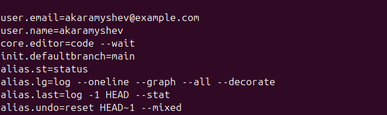
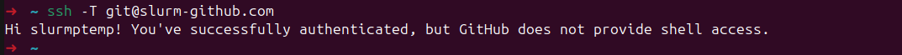
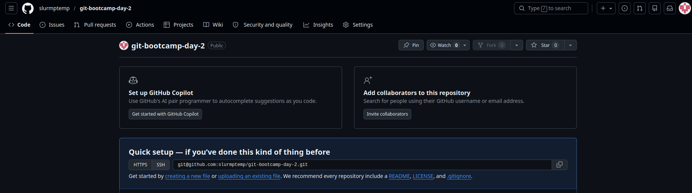
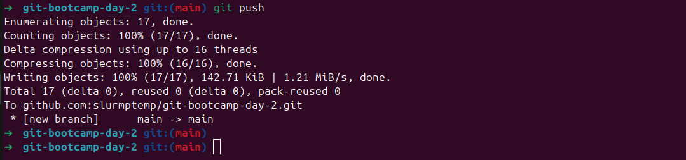
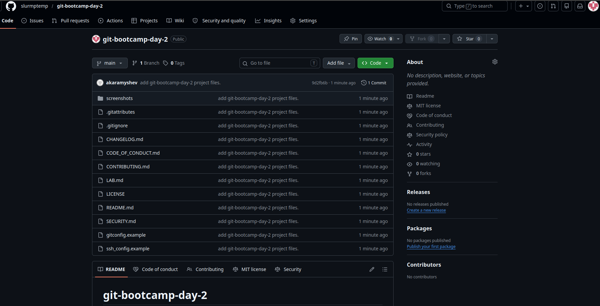

# LAB — день 2

Отчёт о выполнении домашнего задания дня 2 в рамках курса ["Интенсив по погружению в GIT"](https://slurm.io/git-intensive): настройка `gitconfig` и SSH, создание публичного репозитория, наполнение его служебными и стандартными файлами.

## Содержание

- [LAB — день 2](#lab--день-2)
  - [Содержание](#содержание)
  - [Настройка gitconfig](#настройка-gitconfig)
  - [SSH-ключ и подключение к GitHub](#ssh-ключ-и-подключение-к-github)
  - [Создание репозитория](#создание-репозитория)
  - [Служебные файлы](#служебные-файлы)
    - [`.gitignore`](#gitignore)
    - [`.gitattributes`](#gitattributes)
  - [Стандартные файлы и выбор лицензии](#стандартные-файлы-и-выбор-лицензии)
    - [Почему именно эта лицензия](#почему-именно-эта-лицензия)
  - [Markdown](#markdown)
  - [Финальный пуш](#финальный-пуш)

## Настройка gitconfig

```bash
# почта для связи
user.email=akaramyshev@example.com
# имя пользователя для идентификации
user.name=akaramyshev
# IDE как редактор для удобства
code.editor=code --wait
# Актуальная ветка по умолчанию
init.defaultbranch=main
# Псевдонимы для сокращений
alias.st=status
alias.lg=log --oneline --graph --all --decorate
alias.last=log -1 HEAD --stat
alias.undo=reset HEAD~1 --mixed
```

Скриншот вывода `git config --global --list`:



Полный фрагмент моего конфига — в файле [`gitconfig.example`](gitconfig.example).

## SSH-ключ и подключение к GitHub

Использовал, более криптостойкий чем `RSA` алгоритм `ED25519` с passphrase.
В `~/.ssh/config` указан блок подключения для github с `default` юзером `git`.

Скриншот ответа GitHub на `ssh -T git@github.com`:



Фрагмент моего `~/.ssh/config` — в файле [`ssh_config.example`](ssh_config.example).

## Создание репозитория

Создан пустой репозиторий с видимостью Public.

Скриншот свежесозданного репозитория:



## Служебные файлы

### `.gitignore`

Стек: `Python`. Выбрал, потому что один из периодически используемых.

За основу взял шаблон с `https://www.toptal.com/developers/gitignore/api/python` и убрал открывающие и закрывающие комментарии от `API`.

### `.gitattributes`

Минимум — `* text=auto` для нормализации переносов строк между macOS/Linux и Windows. Дополнительные правила:

```text
*.sh  text eol=lf
*.png binary
```

## Стандартные файлы и выбор лицензии

В корне лежат:

- [`README.md`](README.md) — визитка проекта.
- [`CHANGELOG.md`](CHANGELOG.md) — формат Keep a Changelog.
- [`LICENSE`](LICENSE) — выбранная лицензия.
- [`CONTRIBUTING.md`](CONTRIBUTING.md) — как контрибьютить.
- [`CODE_OF_CONDUCT.md`](CODE_OF_CONDUCT.md) — Contributor Covenant.
- [`SECURITY.md`](SECURITY.md) — политика раскрытия уязвимостей.

### Почему именно эта лицензия

При выборе лицензии учитывалось:

- Простота в использовании.
- Открытость для `fork`.
- Минимальная ограниченность ( Копирайтом ).

Ссылка на дерево решений: https://choosealicense.com/

## Markdown

В этом отчёте и в `README.md` использованы:

- заголовки `H1`/`H2`/`H3`;
- оглавление в начале со ссылками на якоря;
- блоки кода с подсветкой (`bash`, `text`);
- сворачиваемый блок (см. ниже);
- ссылки на внешние URL.

<details>
<summary>Пример сворачиваемого блока (можно убрать после проверки)</summary>

Just test repo ¯\_(ツ)_/¯ Nothing to install here...

</details>

## Финальный пуш

Терминал с пушем:



Главная страница репозитория после пуша:


